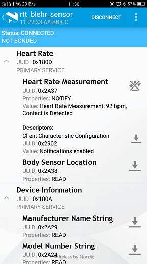

# NRF52832 Nimble BSP 使用说明

## 简介

该 BSP 以 nrf52832 MCU 作为为平台，提供 NimBLE Bluetooth Stack 在 RT-Thread 上的基本功能。

所使用的协议栈为 NimBLE 在 RT-Thread上的移植版本，提供完整的 Host 及 Controller 协议栈支持，主要特性如下：

- 支持 BLE5.0 标准
- 2Msym / s PHY 吞吐量
- 安全管理(SM)，支持 LE Legacy Pairing,  LE Secure Connections, Transport Specific Key Distribution
- 配置灵活，最多支持 32 个并发连接
- 提供常用的 Profile 和 Service 支持
- 清晰的 HCI 接口抽象
- 支持 BLE Mesh(PB-GATT and PB-ADV provisioning, Relay support, GATT Proxy ....)
- 最小 4.5 KB RAM，69KB Flash 的资源占用

更多关于 NimBLE Stack 的介绍请参考 ``http://mynewt.apache.org/latest/network/docs/index.html``。

## 外设支持

本 BSP 目前对外设的支持情况如下：

| **片内外设**      | **支持情况** | **备注**                              |
| :----------------- | :----------: | :------------------------------------- |
| OS_Tick        |     支持      |    |
| GPIO           |     支持      |    |
| UART           |     支持      | TX-->6;RX-->8 |

## 使用说明

当前工程已经默认导入RT-Thread 4.0源码和NimBLE软件包，且打开心率服务(HRS)的配置，无需再次配置，可直接使用MDK5 双击打开工程文件编译。

### 编译及烧写

- 编译工程

直接双击 project.uvprojx 工程文件，打开该工程后，点击 build 按钮，编译生成 hex 文件。

- 烧写

使用 JLINK 连接板子，选择对应的芯片型号，点击 Download 按钮进行烧写。

### 运行结果

烧写完成后，正确连接板载串口至终端软件，复位重新执行，打印如下信息，此时标志 RT-Thread 已经在正常工作，可输入其它 FINSH 命令查看系统状态信息，如 ``ps`` 、 ``free`` 等。

```
 \ | /
- RT -     Thread Operating System
 / | \     4.0.0 build Jan 23 2019
 2006 - 2018 Copyright by rt-thread team
hello world 
msh />
```

### BLE 的简单使用

当前工程提供一个 Heart rate 示例。系统正常运行后，在 Finsh 命令行 输入 `` ble_hr ``，执行该 Demo。如下:

```
msh />ble_hr
[I/nimble] GAP procedure initiated: stop advertising.
[I/nimble] GAP procedure initiated: advertise; disc_mode=2 adv_channel_map=0 own_addr_type=0 adv_filter_policy=0 adv_itvl_min=0 adv_itvl_max=0
msh />
```

此时手机打开 `nRF Master Control Panel` APP，能够扫描到名为 `rtt_blehr_sensor` 的设备，连接之后，模拟的 Heart rate 示例开始运行。现象如下：



## 注意事项

- 该BSP UART默认使用 TX--->6;RX--->8 引脚，可根据板载设计自行修改；
- 该协议栈移植自 Apache 开源方案 Nimble，相关介绍及 API 说明可参考``http://mynewt.apache.org/latest/network/docs/index.html``。


